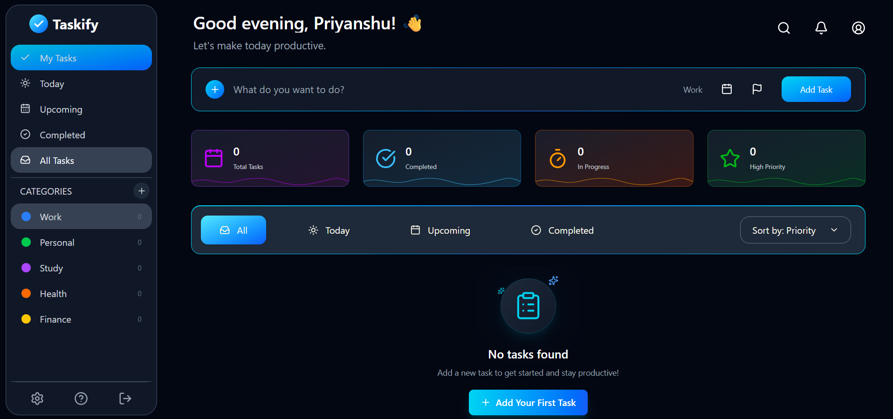

# Taskify

A modern and responsive **Todo List / Task Management Web App** built with **React, Vite, and Tailwind CSS**.

Taskify provides a clean dashboard for creating, organizing, filtering, sorting, and managing daily tasks.

---

## 📸 Preview



---

## ✨ Features

- 📝 **Create Tasks** — Quickly add new tasks.
- 📂 **Task Categories**
  - Work
  - Personal
  - Study
  - Health
  - Finance
- 📅 **Due Dates** — Assign due dates to tasks.
- 🚩 **Priority Tasks** — Mark important tasks as high priority.
- ✅ **Complete Tasks** — Mark tasks as completed or incomplete.
- 🗑️ **Delete Tasks** — Remove tasks when they are no longer needed.
- 🔎 **Search Tasks** — Search tasks by title or category.
- 🔽 **Task Sorting**
  - Priority
  - Due Date
  - Alphabetical
  - Newest
- 🎯 **Task Filters**
  - All
  - Today
  - Upcoming
  - Completed
- 📊 **Task Statistics**
  - Total Tasks
  - Completed
  - In Progress
  - High Priority
- 💾 **Local Storage** — Tasks persist after refreshing the browser.
- 📱 **Responsive Design** — Works across desktop, tablet, and mobile.
- 🌙 **Modern Dark UI** — Clean dark interface with cyan/blue gradients.
- 📱 **Mobile Sidebar** — Slide-out navigation on smaller screens.
- ⏰ **Dynamic Greeting** — Greeting changes according to the current time.

---

## 🛠️ Tech Stack

- **React.js** — Frontend library
- **Vite** — Development and build tool
- **Tailwind CSS** — Styling and responsive design
- **Lucide React** — Icons
- **JavaScript** — Application logic
- **LocalStorage** — Local task persistence

---

## 📁 Project Structure

```text
taskify/
│
├── public/
│
├── src/
│   ├── components/
│   │   ├── LeftBar.jsx
│   │   └── RightHalf.jsx
│   │
│   ├── App.jsx
│   ├── main.jsx
│   └── index.css
│
├── package.json
├── vite.config.js
├── tailwind.config.js
└── README.md
